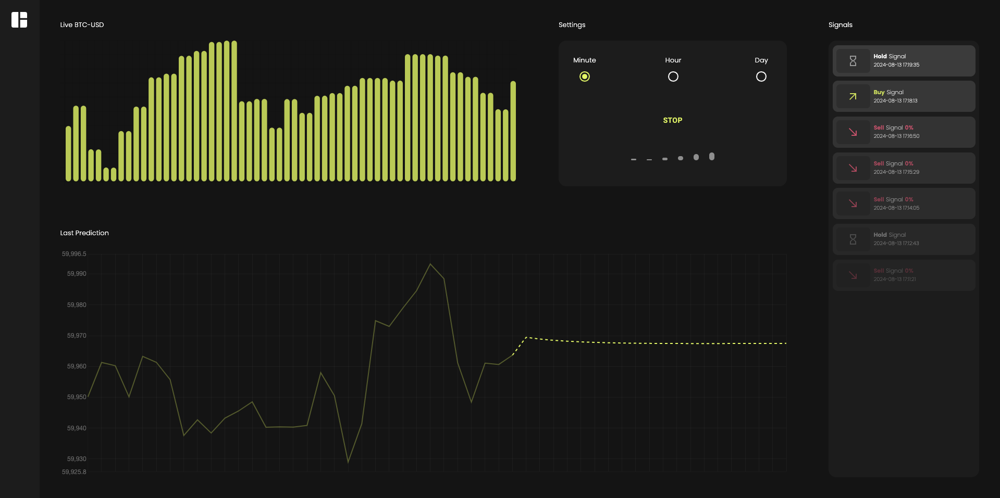

# ML-Based Bitcoin Price Prediction and Trading Signal Generation

## Overview
This repository contains the codebase for a thesis project aimed at predicting future price movements of Bitcoin using machine learning (ML) techniques and developing a software tool to generate trading signals based on these predictions. The primary research question addressed is: **How can the development of a ML-based software using historical data improve cryptocurrency market trend prediction?**

## Aims
The project has the following aims:

1. **Leverage Existing Literature**: Review and identify two deep learning models that are best suited for predicting Bitcoin prices.
2. **Model Development and Integration**: Integrate these models as the core of a trading signal generation software.
3. **Evaluation Through Backtesting**: Compare the generated trading signals against the “buy and hold” strategy.
4. **Potential for Automation**: Lay the groundwork for future integration with digital brokers for automated trading.

## Objectives
The objectives are structured to provide a detailed approach to predicting Bitcoin market trends:

1. **Model Selection**: Identify and select appropriate machine learning models suited for time series tasks.
2. **Data Collection and Processing**: Collect and preprocess historical Bitcoin data (BTC-USD exchange rate).
3. **Model Training and Testing**: Train, test, and validate different models using the collected datasets.
4. **Backtesting**: Compare model predictions against a “buy and hold” strategy to evaluate performance.
5. **Software Development**: Develop a robust software tool to produce market signals on live data.

## Backtesting Results
Starting with a capital of $50,000, this is how the strategy using the models has behaved on two different backtesting datasets:

**Short Shot**


Strategy Earnings: 50,901.61

Buy & Hold Earnings: 50,742.86

**Long Shot**


Strategy Earnings: 13,9958.51

Buy & Hold Earnings: 10,6690.34

## Setting up the Software


Within the Application directory there are two folders, one for the client side and one for the server. Both need to be set up in order for the software to work properly, by following the instructions bellow.

### Prerequisites
Make sure you have the latest Python and pip version installed.
Make sure you have the latest version of npm installed.

### Installation
1. Clone the repository:
```sh
git clone https://github.com/AlecsSandor/MscThesis_ML_Based_Bitcoin_Price_Prediction.git
  ```
2. Once you have the software locally, start installing the dependecies.

server:
```sh
cd MscThesis_ML_Based_Bitcoin_Price_Prediction/Application/server
  ```
```sh
pip install -r requirements.txt
  ```

client:
```sh
cd MscThesis_ML_Based_Bitcoin_Price_Prediction/Application/client
  ```
```sh
npm install
  ```

3. Now that all the dependencies have been installed, the .env files for both client and server have to be created.

Client .env contents:
```sh
REACT_APP_BASE_URL='http://localhost:8000'
REACT_APP_WEBSOCKET_BASE_URL='ws://localhost:8000/ws'
REACT_APP_TICKS_URL='https://api.pro.coinbase.com/products/BTC-USD/ticker'
  ```

Server .env contents:
```sh
PORT=8000
HOST=0.0.0.0
  ```

### Running
In order to start the application you have to:

Start Server:
```sh
cd MscThesis_ML_Based_Bitcoin_Price_Prediction/Application/server
  ```
```sh
python3 server.py
  ```

Start Client:
```sh
cd MscThesis_ML_Based_Bitcoin_Price_Prediction/Application/client
  ```
```sh
npm start
  ```

If all went well, by accessing: http://localhost:3000/ the web app should work!

### Disclaimer

This application was developed as part of an academic dissertation and is intended for research and educational purposes only. The trading signals generated by this app are based on machine learning models and should not be considered as financial advice. The developers are not responsible for any financial losses incurred from using this application. Always conduct your own research and consult with a qualified financial advisor before making any trading decisions.
