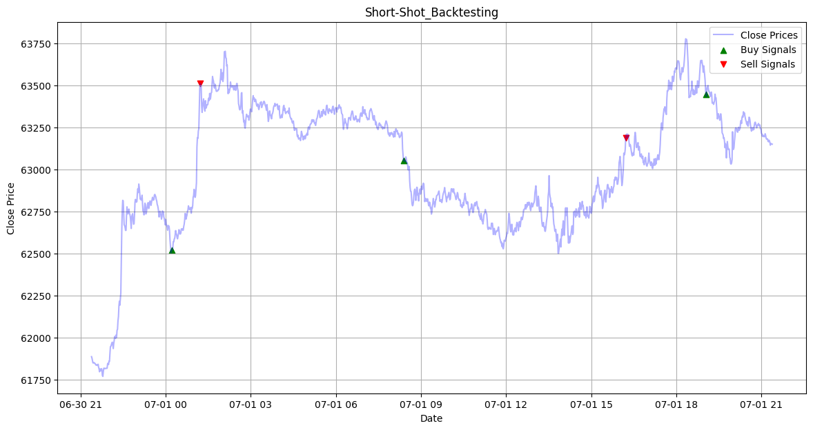
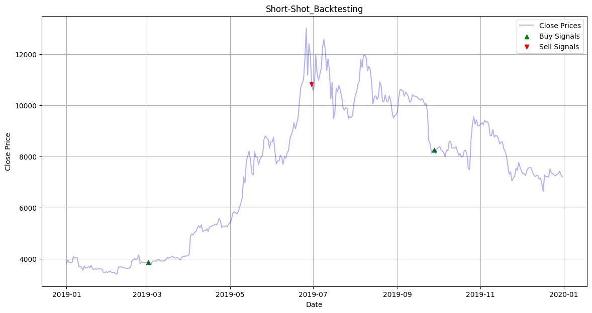

# ML-Based Bitcoin Price Prediction and Trading Signal Generation

## Overview
This repository contains the codebase for a thesis project aimed at predicting future price movements of Bitcoin using machine learning (ML) techniques and developing a software tool to generate trading signals based on these predictions. The primary research question addressed is: **How can the development of a ML-based software using historical data improve cryptocurrency market trend prediction?**

## Aims
The project has the following aims:

1. **Leverage Existing Literature**: Review and identify two deep learning models that are best suited for predicting Bitcoin prices.
2. **Model Development and Integration**: Integrate these models as the core of a trading signal generation software.
3. **Evaluation Through Backtesting**: Compare the generated trading signals against the “buy and hold” strategy.
4. **Potential for Automation**: Lay the groundwork for future integration with digital brokers for automated trading.

## Objectives
The objectives are structured to provide a detailed approach to predicting Bitcoin market trends:

1. **Model Selection**: Identify and select appropriate machine learning models suited for time series tasks.
2. **Data Collection and Processing**: Collect and preprocess historical Bitcoin data (BTC-USD exchange rate).
3. **Model Training and Testing**: Train, test, and validate different models using the collected datasets.
4. **Backtesting**: Compare model predictions against a “buy and hold” strategy to evaluate performance.
5. **Software Development**: Develop a robust software tool to produce market signals on live data.

## Backtesting Results
Starting with a capital of $50,000, this is how the strategy using the models has behaved on two different backtesting datasets:

**Short Shot**

Strategy Earnings: 50,901.61

Buy & Hold Earnings: 50,742.86

**Long Shot**

Strategy Earnings: 13,9958.51

Buy & Hold Earnings: 10,6690.34

## To be completed further...